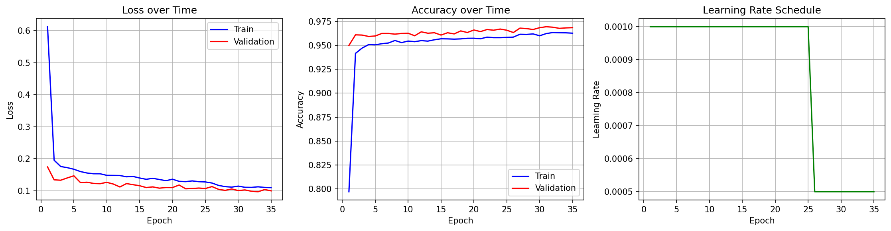
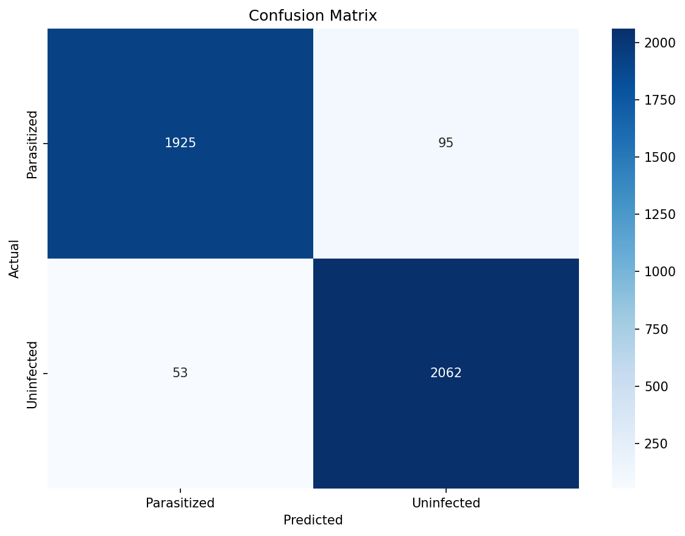
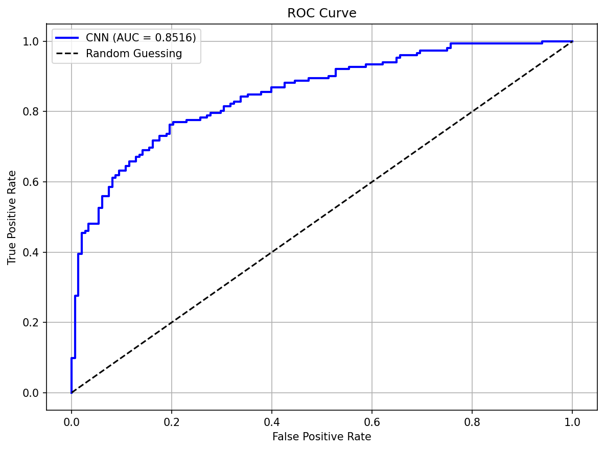

# 🔬 Malaria Cell Detection Using Convolutional Neural Networks

<div align="center">


**St Mary's University Twickenham London**  
**CSO7013 Machine Learning — Mid-Term Module Assessment**

</div>

---

## 📚 About This Project

This repository contains my **Mid-Term Module Assessment** for the **Machine Learning (CSO7013)** module at **St Mary's University Twickenham London**.

| | |
| **Student** | Nevin Tom |
| **Student ID** | 2517238 |
| **Module** | CSO7013 Machine Learning |
| **Assessment** | Mid-Term Module Assessment |
| **University** | St Mary's University Twickenham London |

---

## 🎯 Project Overview

This project implements a **Convolutional Neural Network (CNN)** to detect malaria-infected blood cells from microscope images. The model classifies thin blood smear images as either:

- 🦠 **Parasitized** — Infected with malaria parasites
- ✅ **Uninfected** — Healthy cells

### Why This Matters

Malaria causes over **600,000 deaths annually** (WHO, 2023). Diagnosis requires trained microscopists to manually examine blood samples — a significant bottleneck in resource-limited areas. This CNN achieves **96.42% accuracy** and can assist in automated screening.

---

## 📊 Results

| Metric | Value |
|--------|-------|
| **Accuracy** | 96.42% |
| **Precision** | 0.9560 |
| **Recall** | 0.9749 |
| **F1 Score** | 0.9654 |
| **ROC-AUC** | 0.9936 |

### Baseline Comparison

| Model | Accuracy | Improvement |
|-------|----------|-------------|
| Logistic Regression (Baseline) | 61.96% | — |
| **CNN** | **96.42%** | **+34.46%** |

### Training & Evaluation Visualizations

<div align="center">

| Training History | Confusion Matrix | ROC Curve |
|:---:|:---:|:---:|
|  |  |  |

</div>

---

## 🚀 Quick Start

### 1. Clone the Repository

```bash
git clone https://github.com/Nevvyboi/MalariaCellDetection.git
cd MalariaCellDetection
```

### 2. Set Up Environment

```bash
# Create virtual environment
python -m venv venv

# Activate it
venv\Scripts\activate        # Windows
source venv/bin/activate     # Mac/Linux

# Install dependencies
pip install -r requirements.txt
```

### 3. Download Dataset

1. Download from: [Kaggle - Malaria Cell Images](https://www.kaggle.com/datasets/iarunava/cell-images-for-detecting-malaria)
2. Extract and place in `data/cellImages/`:

```
data/
└── cellImages/
    ├── Parasitized/     ← 13,779 infected images
    └── Uninfected/      ← 13,779 healthy images
```

### 4. Run the Model

```bash
# Quick test (3 epochs, ~2 minutes)
python run.py --quick

# Full training (35 epochs)
python run.py

# Predict on random image
python run.py --predict-random
```

---

## 📁 Project Structure

```
MalariaCellDetection/
│
├── run.py                  # 🚀 Main entry point
├── README.md               # 📖 This file
├── requirements.txt        # 📦 Dependencies
├── LICENSE                 # ⚖️ MIT License
│
├── src/                    # 📁 Source code
│   ├── config.py           # ⚙️ Hyperparameters & settings
│   ├── dataset.py          # 📊 Data loading & preprocessing
│   ├── model.py            # 🧠 CNN architecture
│   ├── train.py            # 🏋️ Training loop
│   ├── evaluate.py         # 📈 Evaluation & visualization
│   └── baseline.py         # 📉 Baseline model
│
├── data/                   # 📂 Dataset (download separately)
│   └── cellImages/
│
├── models/                 # 💾 Saved model weights
│   └── bestModel.pth
│
└── outputs/                # 📊 Generated visualizations
    ├── trainingHistory.png
    ├── confusionMatrix.png
    └── rocCurve.png
```

---

## 🧠 Model Architecture

```
Input: RGB Image (128×128×3)
         │
         ▼
┌─────────────────────────────┐
│  Conv Block 1 (32 filters)  │
│  Conv → BatchNorm → ReLU    │
│  MaxPool(2×2)               │
└─────────────────────────────┘
         │
         ▼
┌─────────────────────────────┐
│  Conv Block 2 (64 filters)  │
│  Conv → BatchNorm → ReLU    │
│  MaxPool → Dropout(0.25)    │
└─────────────────────────────┘
         │
         ▼
┌─────────────────────────────┐
│  Conv Block 3 (128 filters) │
│  Conv → BatchNorm → ReLU    │
│  MaxPool(2×2)               │
└─────────────────────────────┘
         │
         ▼
┌─────────────────────────────┐
│  Conv Block 4 (256 filters) │
│  Conv → BatchNorm → ReLU    │
│  MaxPool → Dropout(0.25)    │
└─────────────────────────────┘
         │
         ▼
┌─────────────────────────────┐
│  Fully Connected (512)      │
│  ReLU → Dropout(0.5)        │
└─────────────────────────────┘
         │
         ▼
┌─────────────────────────────┐
│  Output (2 classes)         │
│  Parasitized / Uninfected   │
└─────────────────────────────┘
```

### Hyperparameters

| Parameter | Value |
|-----------|-------|
| Input Size | 128×128 |
| Batch Size | 64 |
| Epochs | 35 |
| Learning Rate | 0.001 |
| Optimizer | Adam |
| Loss Function | CrossEntropyLoss |
| LR Scheduler | ReduceLROnPlateau |
| Early Stopping | 7 epochs |
| Random Seed | 42 |

---

## 💻 Command Line Options

| Command | Description |
|---------|-------------|
| `python run.py` | Full training (35 epochs) |
| `python run.py --quick` | Quick test (3 epochs, 2000 images) |
| `python run.py --epochs 50` | Custom epochs |
| `python run.py --evaluate-only` | Evaluate saved model |
| `python run.py --predict "image.png"` | Predict single image |
| `python run.py --predict-random` | Predict random test image |

---

## 📋 Requirements

```
torch>=2.0.0
torchvision>=0.15.0
numpy>=1.24.0
matplotlib>=3.7.0
seaborn>=0.12.0
scikit-learn>=1.2.0
tqdm>=4.65.0
Pillow>=9.5.0
```

---

## 📖 Dataset

**NIH Malaria Cell Images Dataset**

| Property | Value |
|----------|-------|
| Source | National Institutes of Health (NIH) |
| Platform | [Kaggle](https://www.kaggle.com/datasets/iarunava/cell-images-for-detecting-malaria) |
| License | Public Domain (US Government Work) |
| Total Images | 27,558 |
| Parasitized | 13,779 (50%) |
| Uninfected | 13,779 (50%) |

---

## 🔧 Troubleshooting

<details>
<summary><b>❌ "Dataset not found" error</b></summary>

Ensure the folder structure is correct:
```
data/
└── cellImages/
    ├── Parasitized/
    └── Uninfected/
```
</details>

<details>
<summary><b>❌ "3 classes detected" error</b></summary>

Delete any extra folders inside `cellImages/`. Only `Parasitized` and `Uninfected` should exist.
</details>

<details>
<summary><b>❌ CUDA out of memory</b></summary>

```bash
python run.py --batch-size 32
```
</details>

<details>
<summary><b>❌ Training too slow</b></summary>

Use quick mode for testing:
```bash
python run.py --quick
```
</details>

---

## 📚 References

1. **Dataset:** National Library of Medicine. (2018). *Malaria Cell Images Dataset*. Kaggle. https://www.kaggle.com/datasets/iarunava/cell-images-for-detecting-malaria

2. **Paper:** Rajaraman, S., et al. (2018). Pre-trained convolutional neural networks as feature extractors toward improved malaria parasite detection in thin blood smear images. *PeerJ*, 6, e4568.

3. **Statistics:** World Health Organization. (2023). *World Malaria Report 2023*.

---

## 📄 License

This project is licensed under the MIT License - see the [LICENSE](LICENSE) file for details.

---

<div align="center">

**Made with ❤️ for CSO7013 Machine Learning**

St Mary's University Twickenham London | 2025

</div>
